

  <h1>🎓 Hệ Thống Hỗ Trợ Lễ Tốt Nghiệp 🎓</h1>
  

    Giải pháp công nghệ hiện đại cho các buổi lễ trang trọng, đảm bảo an toàn và hiệu quả.
  

  

## 🌟 Tổng Quan 🌟

Hệ thống này được phát triển nhằm tối ưu hóa quy trình tổ chức lễ tốt nghiệp, tập trung vào việc tự động hóa xác minh danh tính người tham dự. Bằng cách kết hợp sức mạnh của thuật toán nhận diện khuôn mặt **LBPH** và công nghệ xác thực thẻ **RFID**, hệ thống mang đến một giải pháp toàn diện, vừa nâng cao tính bảo mật, vừa đảm bảo sự thông suốt trong quá trình diễn ra sự kiện.

## ✨ Các Tính Năng Nổi Bật ✨

* **✅ Xác Minh Danh Tính Tự Động:** Nhận diện khuôn mặt sinh viên và khách mời với độ chính xác cao, giảm thiểu tối đa thời gian chờ đợi.
* **🔒 Bảo Mật Hai Lớp Vượt Trội:** Kết hợp xác thực khuôn mặt và thẻ RFID, tạo nên "lá chắn" an toàn, ngăn chặn truy cập trái phép.
* **📊 Theo Dõi Điểm Danh Thông Minh:** Tự động thống kê và báo cáo sự tham gia, hỗ trợ ban tổ chức quản lý sự kiện hiệu quả.
* **🌐 Giám Sát và Điều Khiển IoT:** Cho phép theo dõi và điều khiển hệ thống từ xa, tăng tính linh hoạt và tiện lợi.
* **🎨 Giao Diện Người Dùng Thân Thiện:** Thiết kế trực quan, dễ sử dụng, phù hợp với mọi đối tượng người dùng.
* **🤖 Hỗ Trợ Tức Thì với Chatbox AI:** Tích hợp chatbot thông minh, giải đáp thắc mắc và hỗ trợ người dùng nhanh chóng.

## 🛠️ Công Nghệ và Công Cụ 🛠️

* **Nhận diện khuôn mặt:** Thuật toán LBPH
* **Xác thực thẻ:** Công nghệ RFID
* **Vi điều khiển:** Arduino
* **Xử lý ảnh:** OpenCV
* **Ngôn ngữ lập trình:** Python
* **Thiết kế giao diện:** Qt5 Designer
* **Phát âm thanh:** DFPlayer Mini
* **Quản lý dữ liệu:** MySQL

## ⚙️ Yêu Cầu Phần Cứng ⚙️

* Arduino Uno R3
* Đầu đọc RFID RC522
* Thẻ RFID
* DFPlayer Mini
* Camera
* Loa
* Dây kết nối
* Breadboard

## 💻 Yêu Cầu Phần Mềm 💻

* Arduino IDE
* Python 3.x
* Thư viện OpenCV
* PyQt5
* pyserial

## 🚀 Hướng Dẫn Cài Đặt Nhanh 🚀

1.  **Thiết Lập Phần Cứng:** Kết nối các thiết bị (RFID reader, DFPlayer Mini...) với Arduino Uno R3 theo sơ đồ.
2.  **Cài Đặt Phần Mềm:** Cài đặt Arduino IDE, Python 3.x và các thư viện cần thiết (OpenCV, PyQt5, pyserial).
3.  **Cấu Hình Hệ Thống:**
    * Tải mã nguồn Arduino lên board.
    * Cấu hình ứng dụng Python để liên kết với Arduino và database.
4.  **Chuẩn Bị Dữ Liệu:** Thu thập và lưu trữ ảnh khuôn mặt, liên kết với thông tin thẻ RFID.
5.  **Khởi Chạy Hệ Thống:** Chạy ứng dụng Python và bắt đầu trải nghiệm!

## 🧑‍💻 Hướng Dẫn Sử Dụng 🧑‍💻

1.  **Đăng Ký Người Dùng:** Thêm thông tin người dùng mới, bao gồm ảnh mặt và gán thẻ RFID.
2.  **Xác Minh Tại Sự Kiện:** Người tham dự quẹt thẻ và nhìn vào camera để được xác thực.
3.  **Quản Lý và Giám Sát:** Theo dõi danh sách tham dự, tạo báo cáo và nhận cảnh báo (nếu có).

## 🔮 Hướng Phát Triển Tương Lai 🔮

* ✨ Nâng cao độ chính xác của nhận diện khuôn mặt.
* 🔒 Tăng cường bảo mật và quyền riêng tư của dữ liệu.
* 🔔 Tích hợp thông báo tự động và báo cáo thống kê chi tiết.
* 🧠 Ứng dụng AI và Machine Learning để tối ưu hiệu suất.

## 👥 Đội Ngũ Phát Triển 👥

* Nguyễn Nhật Huy
* Trần Lê Minh Hiếu
* Nguyễn Hồng Hải Dương
* Nguyễn Ngô Trúc Chi

## 🙏 Lời Tri Ân 🙏

* Thầy/Cô **Nguyễn Huy Cường** (Giảng viên hướng dẫn)
* **Trường Đại học Công nghệ TP.HCM (HUTECH)**

## 📚 DEMO 📚
### 🎨 Kết nối IOT 🎨
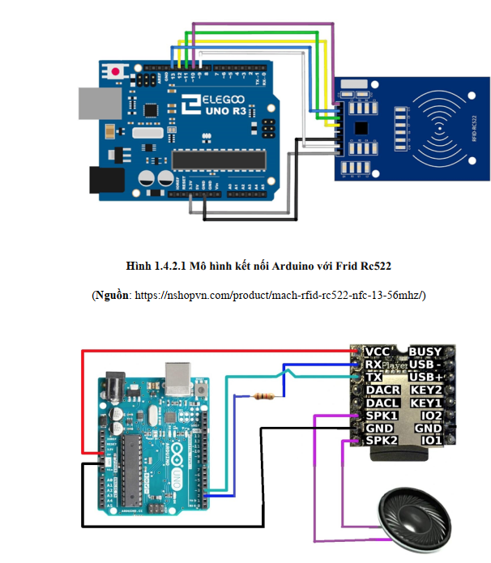
### 🎨 Hình ảnh thực tế 🎨
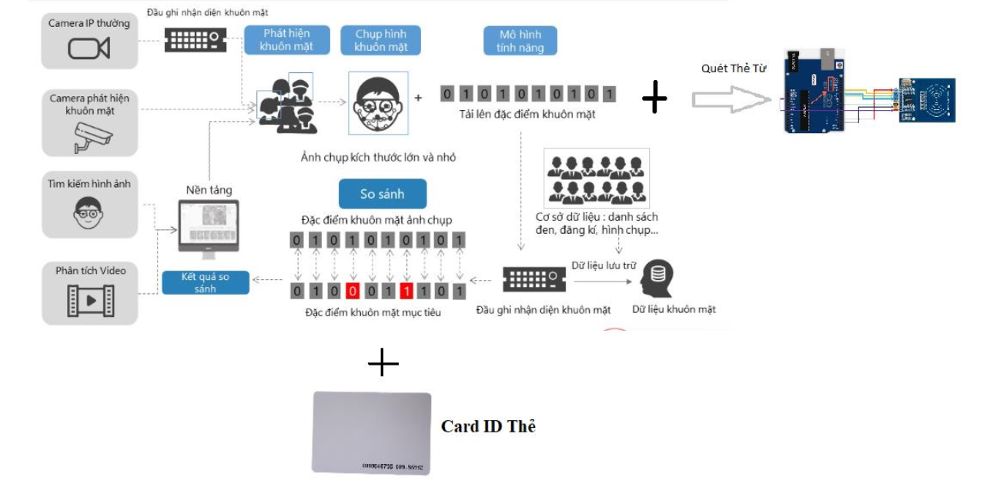
### 🎨 đăng nhập bằng mặt  🎨
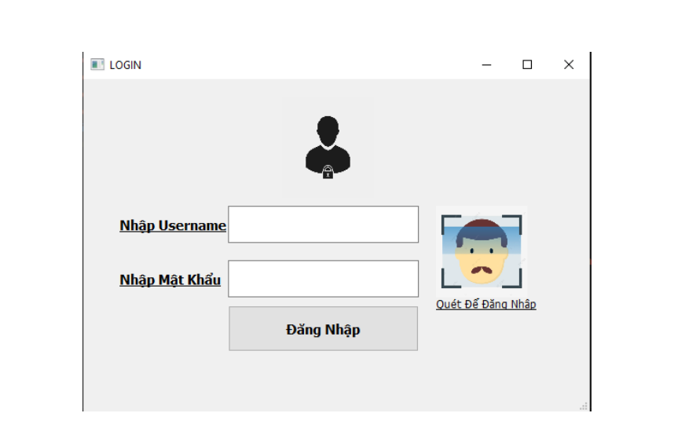
### 🎨 Trang chủ 
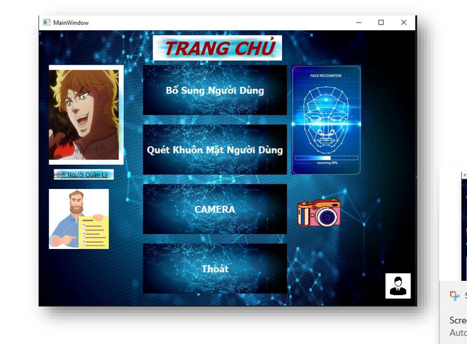
### 🎨 Bảng thêm người 
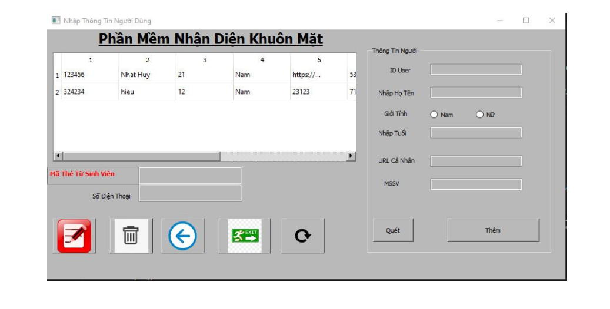

* Cắm Arduino R3 thông qua cổng sau khi kết nối xong sẽ bắt buộc phải để thẻ từ lên mới có thể nhận thêm User được
Sau khi quẹt thẻ lưu thông tin ID thẻ vào trong CSDL
### 🎨 Hiển thị việc chụp ảnh training lưu vòa trong dataset  
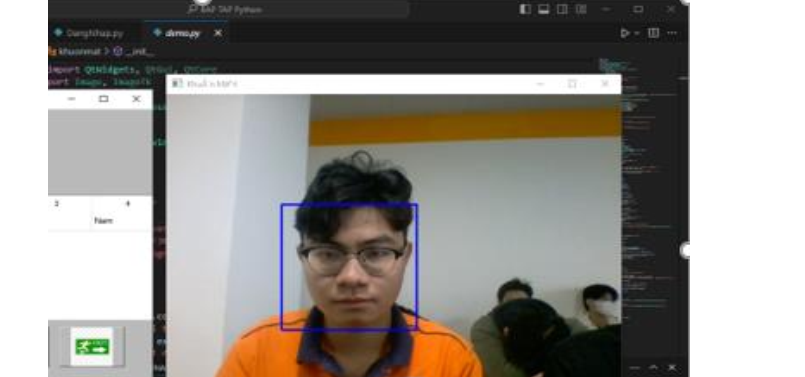 
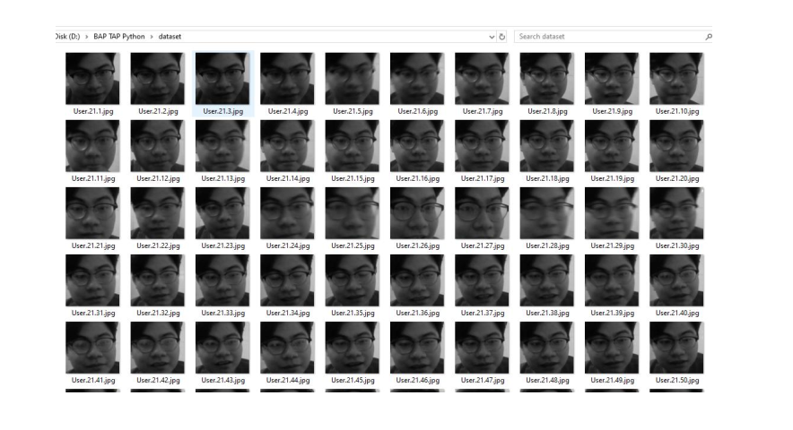

### 🎨 Trang nhận diện 

### 🎨 Thông báo về app nếu phát hiện không có trong dữ liệu 
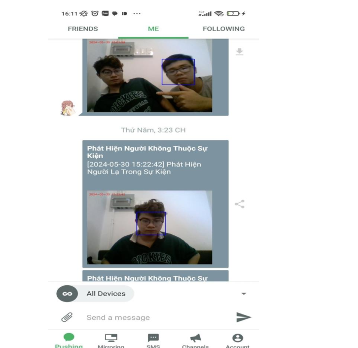
### 🎨 nhấn điểm danh nếu như khuôn măt và thẻ từ khớp trong CSDL sẽ được điểm danh và hiển thị lên mành hình

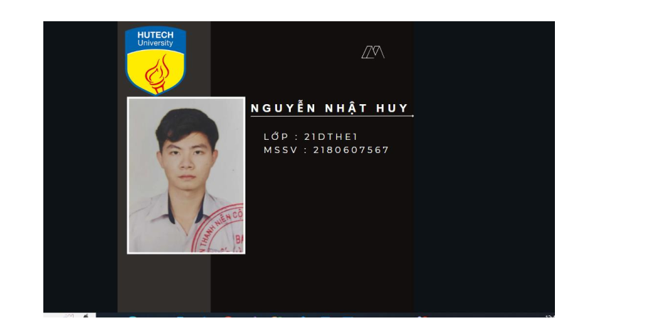
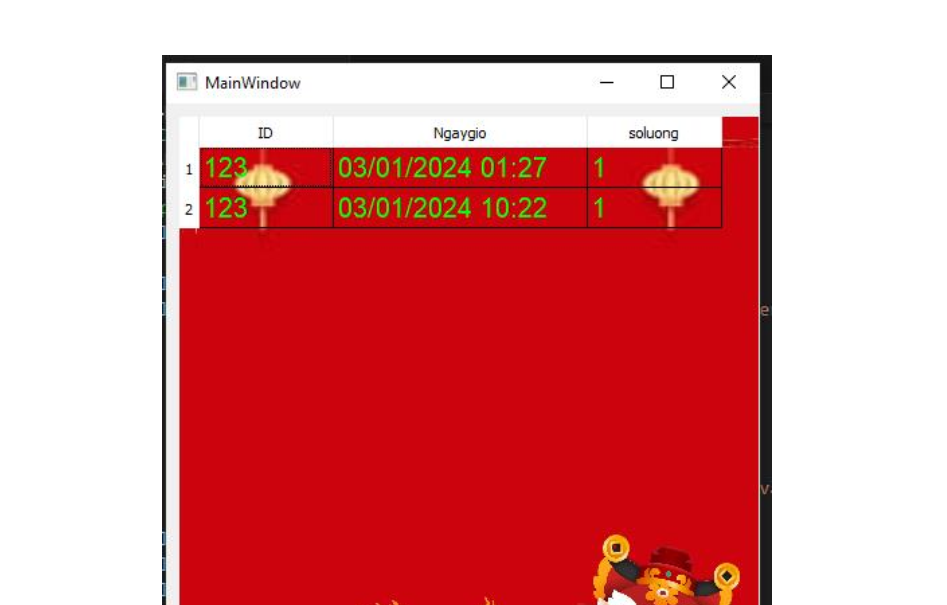
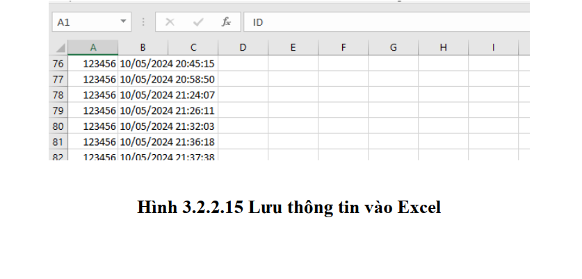